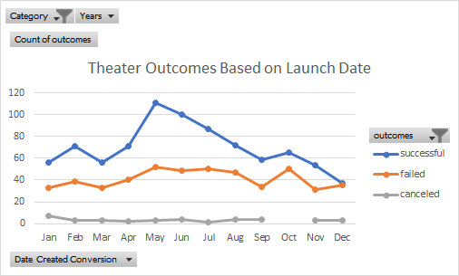

# Kickstarting with Excel

## Overview of Project

### Purpose
The purpose of this analysis is to help Louise gain an understanding of how different campaigns fared in relation to their launch dates and funding goals
## Analysis and Challenges

### Analysis of Outcomes Based on Launch Date
 
>[Contributing Spreadsheet for this Analysis](
>I performed an analysis of theater outcomes based on their month of launch as depicted in the image above and noted that, consistent with the rest of the data, success rate appears to peak between the months of May and June and steadily declines thereafter, with the lowest performing month in December. There does not appear to be a strong correlation between failed/canceled campaigns and the time of year these were launched. 

### Analysis of Outcomes Based on Goals

### Challenges and Difficulties Encountered

## Results

- What are two conclusions you can draw about the Outcomes based on Launch Date?

- What can you conclude about the Outcomes based on Goals?

- What are some limitations of this dataset?

- What are some other possible tables and/or graphs that we could create?

